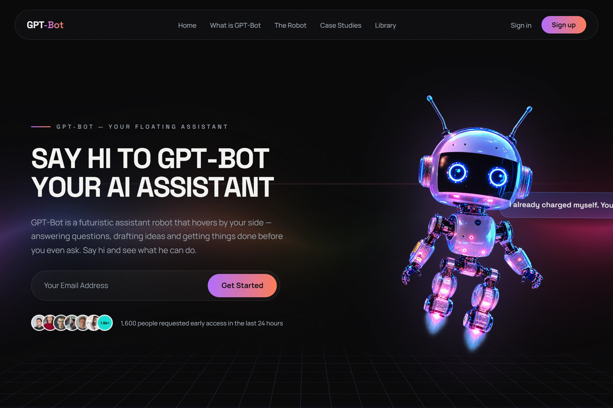

<div align='center'>

[![demo][demo]][demo-link]
[![status][status]][status-link]
[![deploy][deploy]](/)
[![test][tests]][tests-link]

</div>

<div align='center'>
  <a href='/'>
    
  </a>
</div>

<div align='center'>
  <h1>GPT-Bot Landing Page with React</h1>
</div>

<div align='center'>

[![React][react]][react-link]
[![Vite][vite]][vite-link]
[![GSAP][gsap]][gsap-link]
[![OGL][ogl]][ogl-link]
[![JavaScript][javascript]][javascript-link]
[![CSS][css]][css-link]
[![HTML][html]][html-link]
[![React Icons][react-icons]][react-icons-link]

</div>

<div align='center'>
  A cinematic landing page for GPT-Bot — a fictional floating AI assistant robot — built with React 19, Vite and GSAP. A boot-sequence preloader gives way to a pinned scroll-story hero with scrubbed scenes and split-text reveals, starring the floating robot and his cycling speech bubble over a shader-driven WebGL aurora rendered with OGL. Below it sit an infinite partner marquee, a horizontally-scrolled blog filmstrip pinned to vertical scroll, magnetic CTAs and an animated perspective grid floor, all on deep-black and neon design tokens.

[Demo][demo-link] · [Report issue](/issues) · [Suggest something](/issues)

</div>

## Table of Contents

- [Table of Contents](#table-of-contents)
- [Features](#features)
- [Tech Stack](#tech-stack)
- [Getting Started](#getting-started)
  - [Prerequisites](#prerequisites)
  - [Installation](#installation)
  - [Running locally](#running-locally)
  - [Build](#build)
- [Environment Variables](#environment-variables)
- [Project Structure](#project-structure)
- [Demo](#demo)
- [Contributing](#contributing)
- [License](#license)

## Features

- [x] Cinematic boot-sequence preloader with counter and curtain reveal (GSAP)
- [x] Pinned scroll-story hero: scrubbed scenes, split-text char reveal, giant "GPT-BOT" title card (ScrollTrigger + SplitText)
- [x] WebGL aurora backdrop behind the hero — a shader-driven noise field rendered with OGL, reacting to the pointer
- [x] Floating robot assistant with idle hover animation, breathing ground shadow and a cycling speech bubble
- [x] Infinite partner-logo marquee with hover slow-down
- [x] Horizontally-scrolled blog filmstrip pinned to vertical scroll, with progress bar (desktop)
- [x] Data-attribute reveal system — `data-split`, `data-reveal` and `data-reveal-group` wire any element into the scroll timeline
- [x] Split-text line reveals, staggered card reveals and masked parallax images across all sections
- [x] Fixed blur navbar that hides on scroll down / shows on scroll up
- [x] Magnetic CTA button and cursor-follow glow cards
- [x] Animated perspective grid floor (holodeck-style) in hero and footer, film-grain overlay, custom scrollbar and selection styling
- [x] Deep black + neon design tokens, Space Grotesk display type
- [x] Fully responsive — pins and horizontal scroll disabled below 900px, `prefers-reduced-motion` respected
- [x] Component-based architecture with reusable components
- [x] ESLint 10 flat config with zero-warning enforcement

## Tech Stack

- [React 19](https://react.dev/)
- [Vite 8](https://vite.dev/)
- [GSAP 3](https://gsap.com/) (ScrollTrigger, SplitText, @gsap/react)
- [OGL](https://github.com/oframe/ogl)
- [JavaScript (ES Modules)](https://developer.mozilla.org/en-US/docs/Web/JavaScript)
- [CSS3 (Custom Properties)](https://developer.mozilla.org/en-US/docs/Web/CSS)
- [React Icons](https://react-icons.github.io/react-icons/)
- [ESLint](https://eslint.org/)
- [Bun](https://bun.sh/)

## Getting Started

### Prerequisites

- Node.js 18+ (or Bun)
- bun (lockfile detected: `bun.lockb`)

### Installation

```bash
git clone https://github.com/wrujel/webpage-gpt.git
cd webpage-gpt
bun install
```

### Running locally

```bash
bun run dev
```

Open [http://localhost:5173](http://localhost:5173) with your browser to see the result.

### Build

```bash
bun run build
```

| Command           | Action                                       |
| :---------------- | :------------------------------------------- |
| `bun install`     | Installs dependencies                        |
| `bun run dev`     | Starts local dev server at `localhost:5173`  |
| `bun run build`   | Build your production site to `./dist/`      |
| `bun run preview` | Preview your build locally, before deploying |
| `bun run lint`    | Run ESLint to check code quality             |

## Environment Variables

This project does not require any environment variables for basic usage.

## Project Structure

```
/
├── public/
├── src/
│   ├── assets/
│   │   ├── ai_robot.png
│   │   ├── ai.webp
│   │   ├── blog01-05.webp
│   │   ├── logo.svg
│   │   ├── people.png
│   │   ├── possibility.webp
│   │   └── (brand logos)
│   ├── components/
│   │   ├── article/
│   │   ├── brand/
│   │   ├── cta/
│   │   ├── feature/
│   │   ├── navbar/
│   │   ├── preloader/
│   │   ├── ui/
│   │   │   └── SoftAurora.tsx
│   │   └── index.js
│   ├── containers/
│   │   ├── blog/
│   │   ├── features/
│   │   ├── footer/
│   │   ├── info/
│   │   ├── main/
│   │   ├── possibility/
│   │   └── index.js
│   ├── lib/
│   │   └── gsapSetup.js
│   ├── App.jsx
│   ├── App.css
│   ├── main.jsx
│   └── index.css
├── index.html
├── eslint.config.js
├── package.json
├── vite.config.js
└── bun.lockb
```

## Demo

You can check out the demo:

[![Demo][demo]][demo-link]

## Contributing

Contributions are welcome! If you have suggestions or find bugs, please open an issue or submit a pull request.

1. Fork the repository
2. Create your feature branch (`git checkout -b feature/amazing-feature`)
3. Commit your changes (`git commit -m 'Add some amazing feature'`)
4. Push to the branch (`git push origin feature/amazing-feature`)
5. Open a Pull Request

## License

This project is licensed under the [MIT License](LICENSE).

---

<!-- Badges -->

[react]: https://img.shields.io/badge/React-20232A?style=for-the-badge&logo=react&logoColor=61DAFB
[vite]: https://img.shields.io/badge/Vite-646CFF?style=for-the-badge&logo=vite&logoColor=white
[gsap]: https://img.shields.io/badge/GSAP-88CE02?style=for-the-badge&logo=greensock&logoColor=white
[ogl]: https://img.shields.io/badge/OGL-654FF0?style=for-the-badge&logo=webgl&logoColor=white
[javascript]: https://img.shields.io/badge/JavaScript-323330?style=for-the-badge&logo=javascript&logoColor=F7DF1E
[css]: https://img.shields.io/badge/CSS3-1572B6?style=for-the-badge&logo=css3&logoColor=white
[html]: https://img.shields.io/badge/HTML5-E34F26?style=for-the-badge&logo=html5&logoColor=white
[react-icons]: https://img.shields.io/badge/React--Icons-20232A?style=for-the-badge&logo=react&logoColor=61DAFB

<!-- Badge links -->

[react-link]: https://react.dev/
[vite-link]: https://vite.dev/
[gsap-link]: https://gsap.com/
[ogl-link]: https://github.com/oframe/ogl
[javascript-link]: https://developer.mozilla.org/en-US/docs/Web/JavaScript
[css-link]: https://developer.mozilla.org/en-US/docs/Web/CSS
[html-link]: https://developer.mozilla.org/en-US/docs/Web/HTML
[react-icons-link]: https://react-icons.github.io/react-icons/

<!-- Status/Demo badges -->

[demo]: https://img.shields.io/badge/🚀%20Live%20Demo-000000?style=for-the-badge&&logoColor=white&color=0a6bdb
[status-link]: https://github.com/wrujel/monitor-repos
[tests-link]: https://github.com/wrujel/monitor-tests
[demo-link]: https://webpage-gpt-wrujels-projects.vercel.app/
[status]: https://img.shields.io/endpoint?url=https%3A%2F%2Fraw.githubusercontent.com%2Fwrujel%2Fmonitor-repos%2Fmain%2Fdata%2Fwebpage-gpt.json
[deploy]: https://img.shields.io/github/deployments/wrujel/webpage-gpt/production?style=for-the-badge&label=Deploy
[tests]: https://img.shields.io/endpoint?url=https%3A%2F%2Fraw.githubusercontent.com%2Fwrujel%2Fmonitor-tests%2Fmain%2Fdata%2Fwebpage-gpt.json
